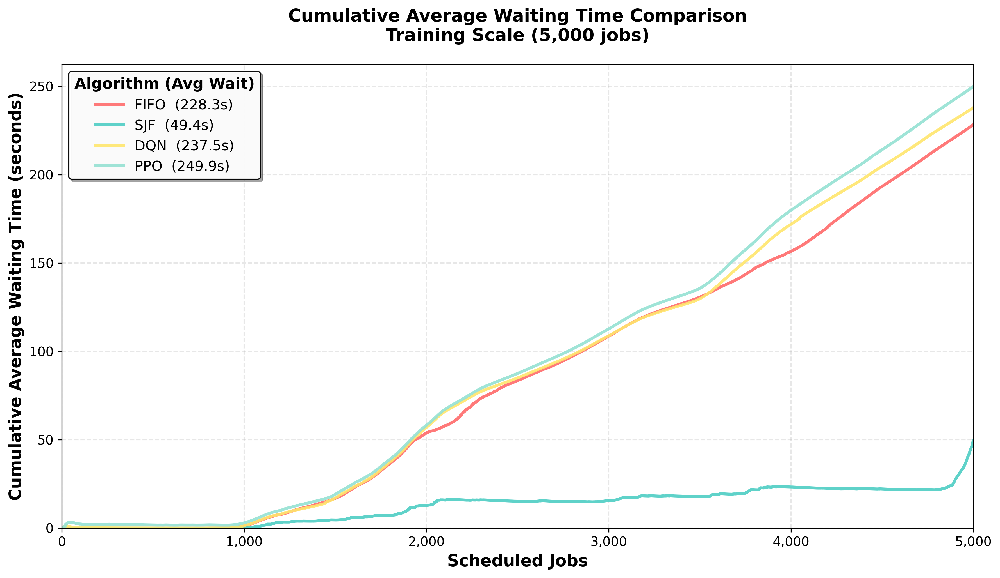

# Deep RL for Cloud Job Scheduling (DQN vs PPO)


A custom Gymnasium environment that simulates a 10-machine cluster replaying real **Alibaba cluster-trace** batch jobs, used to train **DQN** and **PPO** schedulers and benchmark them against classical **FIFO** and **Shortest-Job-First** heuristics on waiting time and makespan.

<p align="center">
  
</p>

---

## Results

**Training scale — 5,000 jobs**

| Scheduler | Avg wait (s) ↓ | Makespan (s) ↓ |
|---|---|---|
| FIFO | 228.5 | 8,623 |
| **SJF** | **49.9** | 8,702 |
| DQN | 249.6 | 8,681 |
| **PPO** | 246.8 | **8,622** |

**Full test set — 13,363 unseen jobs**

| Scheduler | Avg wait (s) ↓ | Makespan (s) ↓ |
|---|---|---|
| FIFO | 460.6 | 11,592 |
| **SJF** | **75.4** | **11,210** |
| DQN | 567.6 | 12,115 |
| PPO | 536.6 | 12,035 |

**What we learned:**
- **PPO matched the best makespan at training scale** (8,622 s), and outperformed DQN on both metrics at both scales.
- **SJF remained the strongest baseline on waiting time** — a well-known result when job durations are known in advance, and a useful reality check: RL agents need the right reward signal and features to beat a strong heuristic.
- Both RL agents degraded on the larger unseen trace (13,363 jobs), pointing to **generalisation beyond training scale** as the main open problem — the natural next step is duration-aware state features and curriculum training on longer traces.

---

## Environment design

- **State (35-dim):** 4 aggregate machine-utilisation features + 3 features for each of the 10 jobs at the front of the queue + queue-length ratio.
- **Action (11 discrete):** dispatch one of the 10 visible queued jobs, or wait.
- **Reward:** negative change in total waiting time per step (delta-wait shaping).
- **Cluster:** 10 machines with CPU and memory capacity constraints (`Machine.py`).

| Agent | Key components |
|---|---|
| DQN | Double DQN (online + target network), experience replay (`DQNAgent.py`, `DQNNetwork.py`, `ReplayBuffer.py`, `Trainer.py`) |
| PPO | Actor-critic, clipped objective, rollout buffer (`PPOAgent.py`, `PPONetwork.py`, `RolloutBuffer.py`, `PPOTrainer.py`) |

---

## Run it

```bash
pip install -r requirements.txt

python evaluate.py      # evaluate the pre-trained agents (dqn_final.pth, ppo_final.pth) → tables + cumulative_wait.png
python RUN_BOTH.py      # train DQN and PPO from scratch in the same environment (several hours on GPU)
python Main.py          # FIFO / SJF baselines + DQN training pipeline
```

`batch_task.csv` is a sample of the public [Alibaba Cluster Trace](https://github.com/alibaba/clusterdata).

---

**Tech:** Python · PyTorch · Gymnasium · NumPy · pandas · scikit-learn · Matplotlib

Built with [Yagni Patel](https://github.com/YagniPatel) · MIT License
